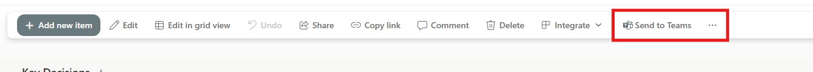

# Share via Teams Chat

This SharePoint Framework (SPFx) solution adds a SharePoint list command that lets users send selected list items or documents to Microsoft Teams chats and channels as a formatted message with an Adaptive Card.

It is designed for SharePoint lists and libraries and supports multi-select, so a user can share several items in one action.

## Screenshots

### Command in the list toolbar



### Share dialog for selecting a Teams destination and composing a message


## What this solution does

- Adds a Send to Teams action to SharePoint list view command sets
- Supports sharing one or more selected items at once
- Lets the user choose a Teams chat or channel destination
- Composes a short message and sends it to Teams
- Includes a rich, formatted Adaptive Card that links back to the SharePoint item or document

## Key features

- Multi-item sharing from SharePoint lists and libraries
- Teams destination picker for chats and channels
- Fluent UI-based dialog experience
- Graph-based integration for Microsoft Teams messaging
- Works with SharePoint list item links and document links

## Prerequisites

Before building or deploying this solution, make sure you have:

- Node.js 22.14.x (recommended for this SPFx sample)
- npm
- A SharePoint tenant with permission to deploy SPFx solutions
- Access to the SharePoint App Catalog
- Microsoft Graph permissions approved by a tenant administrator

## Installation and setup

1. Clone the repository.
2. Install dependencies:

   ```bash
   npm install
   ```

3. Start the local workbench for testing:

   ```bash
   npm start
   ```

4. Open the SharePoint workbench and test the command set.

## Build and package

To build the package locally:

```bash
npm run build
```

This produces the SharePoint package under the solution folder.

## Deployment

1. Package the solution.
2. Upload the generated .sppkg file to the SharePoint App Catalog.
3. Deploy the package to the target site collection.
4. Approve the required Microsoft Graph API permissions in the SharePoint Admin Center.

## Usage

1. Open a SharePoint list or document library.
2. Select one or more items.
3. Choose Send to Teams from the command bar.
4. Select a Teams chat or channel.
5. Add an optional message.
6. Send the message.

## Permissions used

The solution requests delegated Microsoft Graph permissions for:

- Chat.Read
- Chat.ReadWrite
- Chat.ReadBasic
- ChatMessage.Send
- Team.ReadBasic.All
- Channel.ReadBasic.All
- ChannelMessage.Send

## Notes

This sample is intended as a practical reference for building an SPFx list command set that integrates with Microsoft Teams and Microsoft Graph. It demonstrates how to surface a custom action in SharePoint and send contextual content to Teams in a user-friendly way.
